<!-- Header Banner (kanth.me palette: charcoal + gold) -->

<!-- Typing SVG -->

<!-- Counters -->

---

## 🧑‍💻 Who I Am

Senior Full Stack PHP Developer with 17+ years architecting and delivering scalable enterprise applications, RESTful APIs and eCommerce platforms across Laravel, Magento 2 and WordPress. Proven track record improving system performance, security and deployment velocity in regulated, multi-country environments. Currently pursuing doctoral research in AI-driven accessibility systems — bringing applied AI fluency to production engineering, not just tool familiarity.

### 👤 At a Glance

| | |
|---|---|
| 🧑‍💻 **Title** | Senior PHP Full Stack Engineer |
| 🏢 **Current Role** | Full Stack Engineer @ Merck & Co., Inc (MSD), Cambridge — 2021 to present |
| ⏳ **Experience** | 17+ years enterprise web engineering |
| 📍 **Location** | Hertfordshire, UK |
| 🔭 **Status** | Building and scaling AnyVacancy · PhD research in AI & accessibility |
| 💬 **Open To** | Laravel / PHP engineering · API & microservices integration · Magento 2 eCommerce work |

### 🎓 Education

- 🎓 **Doctoral research** — AI-driven accessibility systems *(in progress)*
- 🎓 **MSc Technology & E-commerce** — University of East London
- 🎓 **MA in Education (Higher Education)**
- 🎓 **BSc (Hons) Technology & E-commerce** — University of East London

### 🏛️ Memberships

### 🧰 Stack

| Category | Technologies |
|---|---|
| **Languages** | -ba9960?style=flat-square&logo=php&logoColor=0b0b0b)     |
| **Frameworks** |       |
| **APIs** |      |
| **Databases** | -ba9960?style=flat-square&logo=mysql&logoColor=0b0b0b)     |
| **Quality** |      |
| **DevOps** | -ba9960?style=flat-square&logo=git&logoColor=0b0b0b) -ba9960?style=flat-square&logo=docker&logoColor=0b0b0b)     |
| **Delivery** |   |

### 📜 Certifications

- ✅ BCS (British Computer Society) Professional Graduate
- ✅ Google Certified — Digital Marketing
- ✅ Certificate in PHP *(Distinction)*
- ✅ Certificate in MySQL *(Merit)*
- ✅ Sun Certified Java Programmer Training Program
- ✅ Database Management Systems — Oracle 8i
- ✅ Data Communication & Computer Networking — University of Colombo

### 🏆 Awards

- 🥇 **Inspiring Creativity Award** — Fujitsu Laboratories of Europe, QEII Conference Centre, Westminster

### 🚀 Launched

- **[AnyVacancy](https://anyvacancy.uk/)** — Connecting businesses with qualified local shift workers instantly
  - DBS validation
  - Yoti right-to-work checks
  - Automated UK tax & NI calculations

---

## 🚀 Featured Projects

### AnyVacancy

Connecting businesses with qualified local shift workers instantly. Built-in DBS validation, Yoti right-to-work checks, and fully automated UK tax / National Insurance calculations.

| Layer | Technology |
|-------|------------|
| Backend | PHP 8+, Laravel |
| Frontend | JavaScript (ES6+), TypeScript, HTML5, CSS3 |
| APIs | RESTful APIs, OAuth 2.0 / JWT |
| Integrations | DBS validation, Yoti right-to-work |
| Database | MySQL |
| Infrastructure | Docker, AWS, CI/CD |

🔗 **Live:** [anyvacancy.uk](https://anyvacancy.uk/) &nbsp;·&nbsp; 💻 **Code:** private repository

### More Repositories

---

## 🛠️ Tech Stack

**Languages**

**Frontend**

**Backend & Infra**

**Cloud**

**Databases & APIs**

**Dev Tools**

---

## 📊 GitHub Stats

<!-- Generated daily by .github/workflows/readme-cards.yml (no external service) -->

<!-- streak-stats.demolab.com is not on Vercel and renders reliably -->

<!-- Achievements + contribution activity generated by lowlighter/metrics (same workflow) -->

---

## 🤝 Connect

<!-- Footer Banner (kanth.me palette) -->

